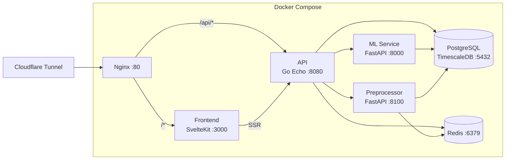

# VitaMetron

**Personal health metrics dashboard with ML-powered recovery insights from wearable data.**

[](https://go.dev/)
[](https://www.python.org/)
[](https://svelte.dev/)
[](https://docs.docker.com/compose/)
[](LICENSE)

> **Disclaimer:** VitaMetron is a personal project for general wellness and informational purposes only. It is **not** a medical device and does not diagnose, treat, or prevent any disease or condition. Always consult a healthcare professional for medical decisions.

---

## What is VitaMetron?

VitaMetron collects daily biometrics from Fitbit, Health Connect, and Apple Watch, then computes a composite **Vitality Recovery Index (VRI)** — a single, personalized recovery score combining heart rate variability, sleep regularity, activity patterns, and other physiological signals.

The system is designed as an **N-of-1 personal model** — all ML models are trained entirely on your own data, capturing your unique physiological patterns rather than relying on population averages. Unlike commercial solutions that hide their methodology, VitaMetron is transparent about its algorithms, assumptions, and limitations.

## Key Features

- **VRI Composite Score** — Fuses multiple biometric signals (HRV, resting HR, sleep duration, SRI, SpO2, deep sleep, breathing rate) via robust Z-score normalization against 60-day personal rolling baselines
- **Sleep Regularity Index (SRI)** — Circadian regularity metric shown to predict mortality better than sleep duration alone (Windred et al., *SLEEP*, 2024)
- **Anomaly Detection** — Isolation Forest identifies unusual days; TreeSHAP explains *why* each day is flagged, not just *that* it is
- **HRV Prediction** — XGBoost + optional LSTM ensemble predicts next-morning HRV with blocked walk-forward validation
- **Subjective-Objective Divergence** — Ridge regression + CuSum detects persistent gaps between how you feel and what your biometrics show
- **Data Quality Scoring** — Every metric comes with confidence estimates integrating wear time, sensor coverage, and baseline maturity
- **Multi-Source Import** — Fitbit (auto-sync), Health Connect (SQLite export), Apple Watch/HealthKit (ZIP upload with chunked transfer)
- **Full-Stack Dashboard** — SvelteKit 2 frontend with real-time metrics, intraday charts, 7-day trends, and ML insight visualization

## Architecture



| Service | Tech | Role |
|---------|------|------|
| **Frontend** | SvelteKit 2, Svelte 5 (Runes), Tailwind CSS 4, Chart.js | Dashboard UI — 7 pages, 49 components |
| **API** | Go 1.24, Echo v4, pgx/v5, go-redis/v9 | REST API, Fitbit OAuth (PKCE), data sync, ML proxy |
| **ML** | Python 3.12, FastAPI, scikit-learn, XGBoost, PyTorch, SHAP, Optuna | VRI scoring, anomaly detection, HRV prediction, divergence detection |
| **Preprocessor** | Python 3.12, FastAPI | Apple Watch/HealthKit data parsing and normalization |
| **PostgreSQL** | TimescaleDB (PG 18) | Time-series storage with hypertables |
| **Redis** | Redis 7 Alpine | OAuth state (PKCE), upload session tracking, job status |
| **Nginx** | Nginx 1.27 Alpine | Reverse proxy, rate limiting, security headers |

## Getting Started

### Prerequisites

- [Docker](https://docs.docker.com/get-docker/) and [Docker Compose](https://docs.docker.com/compose/install/) v2+
- A [Fitbit Developer](https://dev.fitbit.com/) account (for Fitbit data sync)
- (Optional) [NVIDIA Container Toolkit](https://docs.nvidia.com/datacenter/cloud-native/container-toolkit/) for GPU-accelerated ML

### 1. Clone the repository

```bash
git clone https://github.com/your-username/VitaMetron.git
cd VitaMetron
```

### 2. Initialize secrets

```bash
make init-secrets
```

This creates the `secrets/` directory and generates placeholder files. Edit each file with your actual values:

| Secret | Description |
|--------|-------------|
| `secrets/db_password` | PostgreSQL password |
| `secrets/redis_password` | Redis password |
| `secrets/fitbit_client_id` | Fitbit OAuth application client ID |
| `secrets/fitbit_client_secret` | Fitbit OAuth application client secret |
| `secrets/fitbit_redirect_url` | OAuth callback URL (e.g., `https://your-domain.com/api/auth/fitbit/callback`) |
| `secrets/encryption_key` | AES-256-GCM key for OAuth token encryption (32-byte hex string) |

### 3. Configure environment

Set the `ORIGIN` variable for SvelteKit CSRF protection:

```bash
export ORIGIN=https://vitametron.your-domain.com
```

### 4. Build and start

```bash
make build    # build all service images
make up       # start all services (detached)
```

All 7 services start in dependency order with health checks. Database migrations run automatically on API startup.

### 5. Verify

```bash
make health   # check PostgreSQL + Redis
make ps       # show running containers
```

The application is available at `http://localhost:8880` (Nginx).

### 6. Connect Fitbit

1. Open the Settings page in the UI
2. Click "Connect Fitbit" — you'll be redirected to Fitbit's OAuth consent screen
3. Authorize the requested scopes (activity, heartrate, sleep, SpO2, temperature, etc.)
4. After callback, automatic sync begins every 10 minutes

### GPU Support (Optional)

For GPU-accelerated ML training (LSTM model):

```bash
docker compose -f docker-compose.yml -f docker-compose.gpu.yml up -d
```

## Data Sources

| Source | Method | Details |
|--------|--------|---------|
| **Fitbit** | Web API (OAuth 2.0 PKCE) | Auto-sync every 10 min — HR, HRV, sleep stages, SpO2, breathing rate, skin temperature, activity, VO2 Max |
| **Health Connect** | SQLite export upload | ZIP file upload via Settings page — merges with Fitbit data (priority-based deduplication) |
| **Apple Watch / HealthKit** | ZIP upload (chunked) | Chunked transfer up to 2.5 GB — parsed by Preprocessor service, 1-min resampling, sleep session reconstruction |

## Project Structure

```
VitaMetron/
├── api/                        # Go API service
│   ├── cmd/server/main.go      #   Entrypoint, DI wiring
│   ├── domain/
│   │   ├── entity/             #   Domain models (DailySummary, ConditionLog, VRI, ...)
│   │   └── port/               #   Interfaces (repository, biometrics, OAuth, ML)
│   ├── application/            #   Use cases (sync, condition, import, insights)
│   ├── adapter/
│   │   ├── fitbit/             #   Fitbit OAuth + API client
│   │   ├── healthconnect/      #   Health Connect SQLite importer
│   │   ├── postgres/           #   Repository implementations
│   │   └── mlclient/           #   ML service HTTP client
│   ├── handler/                #   HTTP handlers (Echo)
│   ├── infrastructure/         #   Config, server, crypto, cache, DB, scheduler
│   └── mocks/                  #   Hand-written test mocks
├── ml/                         # ML service
│   ├── app/
│   │   ├── main.py             #   FastAPI app with lifespan
│   │   ├── routers/            #   health, vri, anomaly, hrv_predict, divergence, ...
│   │   ├── models/             #   Anomaly detector, HRV predictor, LSTM, divergence
│   │   ├── features/           #   Feature engineering
│   │   └── schemas/            #   Pydantic request/response models
│   └── tests/
├── preprocessor/               # HealthKit data preprocessor
│   └── app/
│       ├── main.py             #   FastAPI app — parse, normalize, aggregate, write
│       └── healthkit/          #   Parser, normalizer, sleep builder, aggregator, writer
├── frontend/                   # SvelteKit frontend
│   └── src/
│       ├── routes/             #   7 pages (dashboard, biometrics, conditions, insights, settings)
│       └── lib/
│           ├── components/     #   49 Svelte 5 components (ui, dashboard, charts, ...)
│           ├── api.ts          #   Browser-side fetch client
│           ├── server/api.ts   #   SSR fetch client (Docker-internal)
│           └── types/          #   TypeScript type definitions
├── nginx/nginx.conf            # Reverse proxy configuration
├── docker-compose.yml          # 7-service orchestration
├── docker-compose.gpu.yml      # GPU override for ML service
├── Makefile                    # Common commands
└── secrets/                    # Docker secrets (gitignored)
```

## Development

### Common Commands

```bash
make up              # docker compose up -d
make down            # docker compose down
make build           # docker compose build
make logs            # docker compose logs -f
make ps              # docker compose ps
make health          # check PostgreSQL + Redis health
```

### Go API

```bash
cd api
go test ./...                    # run all tests
go test ./domain/entity/...      # run single package
go build -o server ./cmd/server  # build binary
```

- Hexagonal architecture: `domain/` → `application/` → `adapter/` → `handler/`
- Table-driven tests with hand-written function-field mocks (no codegen)
- SQLite (`modernc.org/sqlite`) for in-memory repository integration tests

### ML Service

```bash
cd ml
uv sync                          # install dependencies
uv run pytest                    # run all tests
uv run ruff check .              # lint
uv run uvicorn app.main:app      # run dev server
```

- Models persist to `/app/model_store` (Docker volume `ml_models`)
- Train via API: `POST /hrv/train`, `POST /divergence/train`, `POST /anomaly/train`
- Models auto-load on service startup if previously trained

### Frontend

```bash
cd frontend
pnpm install                     # install dependencies
pnpm dev                         # dev server (hot reload)
pnpm build                       # production build
pnpm check                       # svelte-check + TypeScript
```

- Svelte 5 Runes syntax (`$props()`, `$state()`, `$derived()`)
- Tailwind CSS 4 via Vite plugin (not PostCSS)
- SSR with `INTERNAL_API_URL=http://api:8080` for Docker-internal fetches

### Database Migrations

This project uses [goose](https://github.com/pressly/goose) for timestamp-based versioned migrations. Migrations are embedded in the Go binary and run automatically on API startup.

```bash
make migrate-create name=add_xyz   # create new migration file
make migrate-up                    # apply pending migrations
make migrate-down                  # rollback last migration
make migrate-status                # show migration status
```

Migration files live in `api/infrastructure/database/migrations/*.sql`. Each file must contain `-- +goose Up` and `-- +goose Down` annotations. **Never edit a deployed migration** — always create a new one.

## Technical Decisions

| Component | Choice | Rationale |
|-----------|--------|-----------|
| Day boundary | Noon-to-noon | Actigraphy research standard (Ancoli-Israel et al., 2015) |
| HRV metric | Full-night ln(RMSSD) | Avoids sleep-staging errors; lower CV than stage-specific |
| Circadian metric | Sleep Regularity Index | Strongest mortality evidence; uncorrelated with duration |
| Normalization | Robust Z-score (median/MAD) | Outlier-resistant (Leys et al., 2013) |
| Baseline window | 60-day rolling | Consensus across HRV4Training, Suunto, Oura |
| Primary ML model | XGBoost (max_depth=3) | Best performer at small N (Wu et al., 2025) |
| Ensemble member | LSTM (PyTorch) | Included only when it improves validation metrics |
| Validation | Blocked walk-forward | Prevents temporal data leakage |
| Anomaly detection | Isolation Forest (1–3%) | Unsupervised; linear scaling; no labels needed |
| Explainability | TreeSHAP | Per-feature contribution to every score and anomaly |
| Architecture | Hexagonal (ports & adapters) | Biometrics provider is swappable (Fitbit / Health Connect / HealthKit) |
| Auth model | Cloudflare Tunnel | Single-user app; no in-app authentication needed |
| Token storage | AES-256-GCM encrypted | OAuth tokens encrypted at rest via Docker Secrets key |
| Time-series DB | TimescaleDB hypertables | Efficient range queries on HR intraday, sleep stages, daily summaries |

## How It Works

<details>
<summary>Science and methodology</summary>

### Data Ingestion & Quality Control

Raw wearable data is ingested using **noon-to-noon day boundaries** — the actigraphy research standard (Ancoli-Israel et al., 2015). A tiered validation framework filters data by wear time (>=10 hours), physiological plausibility (e.g., resting HR 30-100 bpm, RMSSD 5-300 ms), and minimum compliance. Days with insufficient data quality are flagged rather than silently imputed.

### VRI Composite Score

The core recovery index fuses multiple metrics — each normalized as robust Z-scores (median/MAD) against 60-day personal rolling baselines. The **Sleep Regularity Index** serves as the primary circadian metric. **Full-night ln(RMSSD)** provides the autonomic nervous system signal. Every score is accompanied by a confidence estimate reflecting data completeness, sensor coverage, and baseline maturity.

### Anomaly Detection

An Isolation Forest model with conservative contamination rates (1-3%) identifies physiologically unusual days. **TreeSHAP** decomposes each anomaly into per-feature contributions, producing human-readable explanations. A data quality pre-gate suppresses alerts on days with poor sensor coverage, mitigating alarm fatigue.

### Predictive Recovery Model

An **XGBoost model with aggressive regularization** (max_depth=3, subsample=0.7, early stopping) predicts next-morning HRV Z-score. An optional LSTM ensemble member is included only when it demonstrates measurable improvement. Evaluation uses **blocked walk-forward validation** with a 1-day gap to prevent temporal data leakage.

### Subjective-Objective Divergence

Momentary self-assessments are compared against biometric predictions through Ridge regression and **CuSum (cumulative sum) control charts**. Persistent divergence surfaces patterns that pure biometrics miss, such as psychological stress, incipient illness, or habituation to poor recovery.

</details>

## Design Principles

| Principle | In Practice |
|-----------|-------------|
| **Evidence first** | Every component is grounded in peer-reviewed research. No feature is included without empirical support. |
| **Honest uncertainty** | Confidence scores, data quality gates, and layered uncertainty communication are first-class features. |
| **Alarm fatigue awareness** | Conservative thresholds, multi-signal fusion, and quality pre-filtering minimize false positives. |
| **Transparent by default** | Raw metric trends are always available alongside composite scores. SHAP explains every result. |

## API Reference

The Go API exposes 30+ endpoints under `/api/`. All ML-powered endpoints proxy to the ML service internally.

<details>
<summary>Endpoint overview</summary>

### Biometrics
| Method | Path | Description |
|--------|------|-------------|
| `GET` | `/api/biometrics` | Daily summary for a date |
| `GET` | `/api/biometrics/range` | Daily summaries for a date range (max 31 days) |
| `GET` | `/api/biometrics/quality` | Data quality metrics for a date |
| `GET` | `/api/biometrics/quality/range` | Data quality for a date range |
| `GET` | `/api/heartrate/intraday` | 1-minute heart rate samples |
| `GET` | `/api/sleep/stages` | Sleep stage data |

### Condition Logging
| Method | Path | Description |
|--------|------|-------------|
| `POST` | `/api/conditions` | Record a condition log (1-5 scale + VAS) |
| `GET` | `/api/conditions` | List condition logs (paginated, filterable) |
| `GET` | `/api/conditions/:id` | Get a single condition log |
| `PUT` | `/api/conditions/:id` | Update a condition log |
| `DELETE` | `/api/conditions/:id` | Delete a condition log |
| `GET` | `/api/conditions/tags` | List all tags with counts |
| `GET` | `/api/conditions/summary` | Condition statistics (avg, min, max) |

### ML Insights
| Method | Path | Description |
|--------|------|-------------|
| `GET` | `/api/vri` | VRI score for a date |
| `GET` | `/api/vri/range` | VRI scores for a date range |
| `GET` | `/api/anomaly` | Anomaly detection for a date |
| `GET` | `/api/anomaly/range` | Anomaly detection for a date range |
| `GET` | `/api/hrv/predict` | HRV prediction for a date |
| `GET` | `/api/hrv/status` | HRV model status |
| `POST` | `/api/hrv/train` | Train HRV prediction model |
| `GET` | `/api/divergence` | Divergence detection for a date |
| `GET` | `/api/divergence/range` | Divergence detections for a date range |
| `POST` | `/api/divergence/train` | Train divergence model |
| `GET` | `/api/insights/weekly` | Weekly insights summary |

### Fitbit OAuth
| Method | Path | Description |
|--------|------|-------------|
| `GET` | `/api/auth/fitbit` | Get OAuth authorization URL |
| `GET` | `/api/auth/fitbit/callback` | OAuth callback handler |
| `GET` | `/api/auth/fitbit/status` | Check authorization status |
| `DELETE` | `/api/auth/fitbit` | Disconnect Fitbit |

### Data Import
| Method | Path | Description |
|--------|------|-------------|
| `POST` | `/api/sync` | Trigger manual Fitbit sync |
| `POST` | `/api/import/health-connect` | Upload Health Connect ZIP |
| `POST` | `/api/import/healthkit/init` | Initialize chunked HealthKit upload |
| `PUT` | `/api/import/healthkit/chunk/:uploadId/:chunkIndex` | Upload a chunk |
| `POST` | `/api/import/healthkit/complete/:uploadId` | Complete chunked upload |
| `GET` | `/api/import/healthkit/status/:jobId` | Poll import job status |
| `GET` | `/api/import/healthkit/stream/:jobId` | SSE stream for import progress |

### Health
| Method | Path | Description |
|--------|------|-------------|
| `GET` | `/health` | Basic health check |
| `GET` | `/api/health` | Detailed health (DB + Redis) |

</details>

## Regulatory Note

VitaMetron operates within the scope of the FDA's [General Wellness Policy](https://www.fda.gov/regulatory-information/search-fda-guidance-documents/general-wellness-policy-low-risk-devices) (revised January 2026). It displays values, ranges, trends, and baselines for general wellness purposes. It does **not** reference specific diseases, provide clinical thresholds, offer treatment guidance, or claim clinical equivalence to medical devices.

## References

<details>
<summary>Selected references</summary>

- Ancoli-Israel, S. et al. (2015). SBSM Practice Guide for Actigraphy. *Behavioral Sleep Medicine*.
- Beelen, D. et al. (2024). Fitbit HR data missingness patterns.
- Chaput, J.-P. et al. (2025). Sleep duration and regularity. *J. Epidemiology & Community Health*.
- Cvach, M. (2012). Monitor alarm fatigue. *Biomedical Instrumentation & Technology*.
- Doherty, C. et al. (2025). Composite health scores from wearables. *Translational Exercise Biomedicine*.
- Fischer, D., Klerman, E.B. & Phillips, A.J.K. (2021). Comparison of sleep regularity metrics. *SLEEP*.
- Leys, C. et al. (2013). Detecting outliers with MAD. *J. Experimental Social Psychology*.
- Lim, S. et al. (2024). Circadian phase shifts as predictors. *NPJ Digital Medicine*.
- Lundberg, S.M. et al. (2020). TreeSHAP. *Nature Machine Intelligence*.
- Mishra, T. et al. (2021). Pre-symptomatic detection from wearables. *Nature Medicine*.
- Phillips, A.J.K. et al. (2017). Sleep Regularity Index. *Scientific Reports*.
- Plews, D.J. et al. (2012). HRV training monitoring. *European J. Applied Physiology*.
- Windred, D.P. et al. (2024). SRI and mortality in UK Biobank. *SLEEP*.
- Wu, J. et al. (2025). XGBoost for mood prediction from Fitbit. *JMIR*.

</details>

## License

[MIT](LICENSE)

---

*Built with curiosity, skepticism, and respect for what the data can — and cannot — tell us.*
